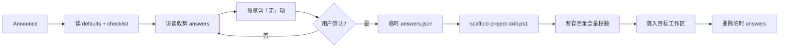

# gengens-dev-skill-creator

访谈式元技能：问清仓库约定后，用 scaffold 生成 `{name}-dev` 项目 skill（`.agents/skills/`）。之后启停、提交、验证、发布、查库都走同一套脚本，不必每次口头拼命令。

默认**不侵入仓库**：skill、私人文档与运行时数据落在本机并 gitignore，不进 Git；需要团队共用时再改为随仓提交。

| 运行时 | 落盘 | 多项目 | 默认可见性 |
|--------|------|--------|------------|
| Claude Code / Cursor 等 | 仅 `scripts/scaffold-project-skill.ps1` | `-Project <名\|all>` | 本地专用（不进 Git） |

脚手架需要 **Windows PowerShell 5.1+**。

---

## 生成物能力图谱

`{name}-dev` 是本仓的开发操作面。图中实线为**始终生成**，虚线为访谈里答了命令才生成。

```mermaid
flowchart TB
  Skill["`{name}-dev`<br/>`.agents/skills/`"]

  subgraph Always["始终生成"]
    direction TB
    Site["站点生命周期<br/>Start / Stop / Restart"]
    Status["状态与日志<br/>Show-ProjectStatus"]
    Commit["无水印提交<br/>Invoke-ProjectCommit"]
    Db["查库<br/>Invoke-DbQuery"]
    Docs["私人文档<br/>private_docs/"]
    Arch["代码地图<br/>architecture.md"]
    Domain["领域知识库<br/>domain/"]
  end

  subgraph Optional["按答案生成"]
    direction TB
    Init["首次准备<br/>Init-Project"]
    Verify["验证<br/>build / test / lint"]
    Pub["发布<br/>Local / Online / Env"]
  end

  subgraph Runtime["运行时 · 勿提交密钥"]
    direction LR
    Pids[".runtime/pids.json"]
    Logs[".runtime/logs/"]
    Conn[".runtime/connections.json"]
  end

  Skill --> Always
  Skill --> Optional
  Site --> Pids
  Site --> Logs
  Status --> Pids
  Status --> Logs
  Db --> Conn
  Pub -.-> Conn
```

多项目时，启停 / 验证 / 发布按 `projects[]` 展开；没配的目标不生成脚本，文档也不写空壳。

### 本地专用 vs 随仓共享

| 可见性 | 谁看得见 | 进 Git 的内容 |
|--------|----------|---------------|
| **local（默认）** | 仅本机代理 | `.agents/skills/`、私人文档、`.runtime/` 全部 ignore |
| **shared** | 克隆仓库的人 | skill 随仓提交；仍 ignore `.runtime/`（PID、日志、连接串） |

两种模式都不推送连接串和进程状态。差别只在操作面本身要不要成为仓库的一部分。

### 能力与脚本对照

| 能力 | 脚本 / 路径 | 要点 |
|------|-------------|------|
| 启停重启 | `Start-Site` / `Stop-Site` / `Restart-Site` | 写前台命令即可；后台记 PID；停止不按进程名 kill |
| 状态排查 | `Show-ProjectStatus` | 没起来或刚崩时自动打日志尾部 |
| Git 提交 | `Invoke-ProjectCommit` | 预览 → 确认；`git commit --only`；拦 Cursor 水印 |
| 查库 | `Invoke-DbQuery` | 连接在 `.runtime`；`writePolicy` 仅文本拦截 |
| 私人文档 | `{DocsRoot}/` | 默认 `private_docs/`，gitignore |
| 代码地图 | `references/architecture.md` | 首次探索经确认后回填 |
| 领域知识 | `references/domain/` | overview / modules / rules / schema |
| 首次准备 | `Init-Project`（可选） | 装依赖、复制 `.env` 等 |
| 验证 | `Invoke-Verify`（可选） | test 建议带 `%FILTER%` |
| 发布 | `Publish-*`（可选） | 本地 / 线上按项目；其它环境仓库级 |

落盘细节见 [`references/project-skill-anatomy.md`](references/project-skill-anatomy.md)。

---

## 私人文档结构（`private_docs/`）

生成时会在仓库根创建私人文档根（默认 `private_docs`，可改名）并 gitignore。草稿、截图、SQL、任务笔记留在本机；公有说明仍写仓库 `docs/`（若有）。

```text
private_docs/
├── task/          # 按任务归档：一任务一目录
├── tmp/           # AI 临时输出
├── resource/      # 原始资料（规格、截图、导出等）
└── sql/           # 私人 SQL：YYMMDD-模块-作用.sql
```

**开新任务时，在 `task/` 下建目录写文档**，把相关上下文都放进该目录——需求、讨论摘录、接口草稿、验收清单、本地笔记均可。代理做任务时优先读这个目录，上下文集中、可回溯。

| 场景 | 路径 |
|------|------|
| 单项目 | `task/NNN-简述/`（如 `001-登录页重做/`） |
| 多项目 | `task/<项目名>/NNN-简述/`（如 `task/web/012-筛选器/`） |

序号 = 该目录下现有最大号 + 1。跨任务资料进 `resource/`，一次性草稿进 `tmp/`，可复用查询进 `sql/`。

---

## 安装

把下面这句话发给 Agent：

> 请从 https://github.com/gengens1/gengens.dev.skill.creator.git 克隆到本机 Agent 技能目录（Claude：`~/.claude/skills/gengens-dev-skill-creator`；Cursor：等价 skills 路径）。

---

## 生成流程



1. Announce：`Using gengens-dev-skill-creator`
2. 按 [`interview-checklist.md`](references/interview-checklist.md) 访谈（有询问工具可一次多题，否则每次一题）
3. **预览**并复述判「无」的项（如 `web.stop = 无`）→ 确认后再写盘
4. 跑 scaffold：

```powershell
$CreatorRoot = "<技能安装目录>"   # 含本 SKILL.md 的目录
$Answers = Join-Path $env:TEMP ("project-dev-answers-" + [guid]::NewGuid().ToString("N") + ".json")
# 写入 $Answers 后：
powershell -NoProfile -ExecutionPolicy Bypass -File (Join-Path $CreatorRoot "scripts\scaffold-project-skill.ps1") `
  -RepoRoot "REPO_ROOT" `
  -SkillName "name-dev" `
  -DocsRoot "private_docs" `
  -AnswersJsonPath $Answers `
  [-Force]
```

5. 核对 stdout：`SCAFFOLD_OK`、`STAGING_VALIDATE_OK`、`SKILL_VALIDATE_OK`、`PROJECT_DEV_CREATOR_OK`，并转述 `ANSWER_READ_AS_NONE` / `SKILL_BACKUP` / `PUBLISH_ENABLED` 等
6. 删除临时 answers.json

答案形状见 [`answers.example.json`](references/answers.example.json)。

> **`-Force`**：用模板重写全部脚本（含已补全的 `Publish-Env.ps1` / `Invoke-DbQuery.ps1`）。旧目录备份到临时路径（`SKILL_BACKUP=`），合并需自行处理。

---

## 目录结构

```text
.
├── SKILL.md                       # 元技能入口
├── scripts/scaffold-project-skill.ps1
├── assets/
│   ├── creator-strings.json       # 文案表（.ps1 保持 ASCII）
│   └── project-skill-template/    # 展开模板
└── references/                    # 访谈清单、默认值、解剖文档
```

---

## 硬约束

| 规则 | 说明 |
|------|------|
| 只走 scaffold | 禁止手工抄模板 |
| 名称 ASCII | skill / 项目名走命令行；非 ASCII 会在控制台代码页下损坏 |
| 启动写前台命令 | 不要自己包 `Start-Process` |
| 停止不按进程名 | 答「无」则交给 PID 树清理 |
| 测试带 `%FILTER%` | 才支持 `-Filter`；无占位符时在 `-Project all` 下跳过 |
| 未答不算有 | 没给的发布 / 验证不生成脚本与文档 |

校验在**暂存目录**完成（frontmatter、残留 `{{TOKEN}}`、`.ps1` AST、发布/验证与答案一致）。失败不落半成品。

---

## 隐私与安全

1. 勿把真实连接串、密码、令牌写进示例或版本库；`.runtime/connections.json` 必须 ignore。
2. 访谈中的连接串会进入临时 answers 与 `.runtime/`——用完删除临时文件。
3. `writePolicy` 只是脚本层文本拦截；真正边界用只读数据库账号。

---

## 相关文档

- [SKILL.md](SKILL.md) — 代理工作流与成功判据
- [references/interview-checklist.md](references/interview-checklist.md) — 访谈清单
- [references/defaults.md](references/defaults.md) — 默认约定
- [references/project-skill-anatomy.md](references/project-skill-anatomy.md) — 生成物解剖
